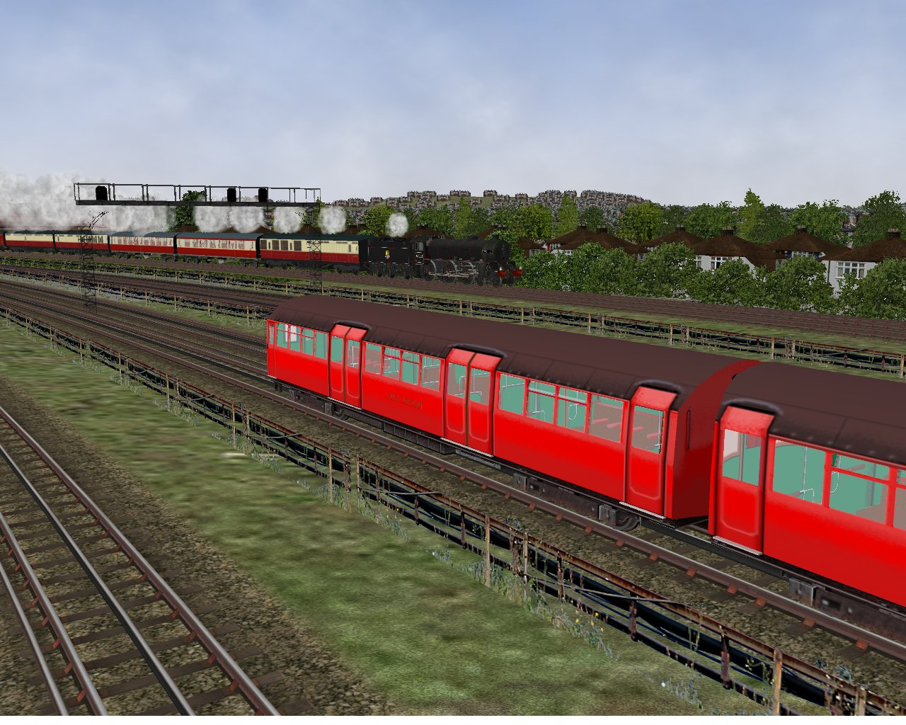

# Chiltern Route

## Scenario
A route for Open Rails by DocMartin. 

This route represents the two main lines passing through the Chiltern Hills to London as they were circa 1960. These lines are:
- the ex-GWR/GCR from Banbury to Marylebone and Paddington via Princes Risborough
- the High Wycombe and the ex-GCR/Metropolitan from Woodford Halse to Marylebone and Baker Street via Aylesbury

The connecting branches between the two routes are included. The line from Banbury to Didcot via Oxford also forms part of the route as well as a section of the Great Western main line from Paddington between Friars Lane and Southall. A considerable number of related branches are also included.  

Also modelled are substantial parts of the London Transport underground system where it parallels or shares lines with the main BR lines, including parts of the Metropolitan, the Piccadilly, the Bakerloo, the District and the Central Lines. 

While every effort has been made to make the overall "feel" of the route as authentic as possible, it is not completely prototypical in so far as track plans from a variety of historical periods had to be used. In addition, the Shepherds Bush to Uxbridge tram route has beeen included for the benefit of tram enthusiasts. The inclusion of this route is, of course, a complete anachronism since the trams on this route were amongst those replaced by trolleybuses in 1936 and trams in London in general were withdrawn in 1952.

The route is a work-in-progress and will continually be updated. Work on placing scenery is still progressing.  It is probable that some non-fatal errors exist, some of which will be a MSTS legacy. I hope that these will gradually be reduced as they are identified. 

## Compatibility
This content is compatible with Open Rails v1.4 (and not with MSTS). The content is stand-alone and only needs an Open Rails installation.

## Installing
**Highly Recommended**: Follow [these instructions](https://www.dropbox.com/s/gh2f2pko4f1houj/Using%20routes%20published%20on%20GitHub%20v2.pdf?dl=0) to benefit from using Git.

or

Quick: [Download the ZIP](https://github.com/DocMartin7644/Chiltern-Route/archive/refs/heads/main.zip) and unpack it.

## Legal
Activities prefixed with RS_ are the work of Richard Stevenson, who has my thanks. Whilst some of the stock used are my own creations, the majority is the work of other authors, who retain the copyright of their productions. These authors also have my thanks.

This work is published under the Creative Commons 4.0 International licences: 

1. the Chiltern route by CC-BY #Licence
2. Third party models and rolling stock by CC-BY-NC-ND #Licence.

Licence details are to be found at [About CC Licenses - Creative Commons](https://creativecommons.org/about/cclicenses/)
